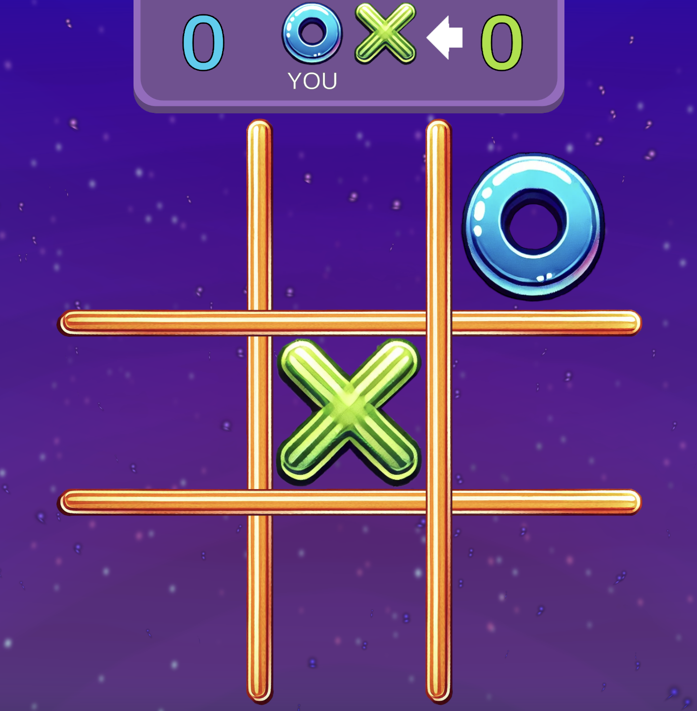
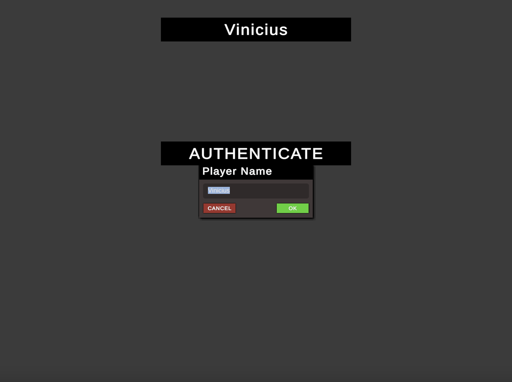
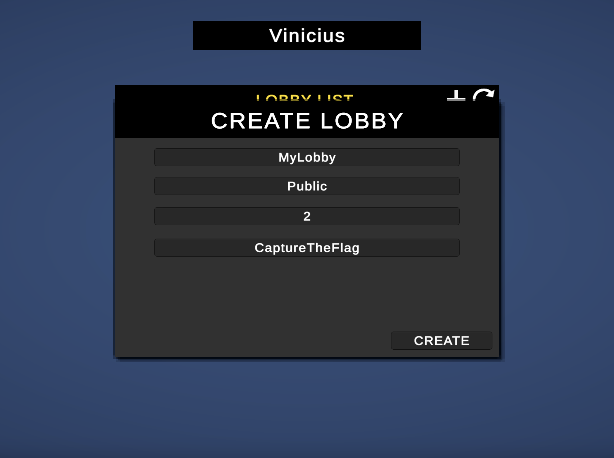
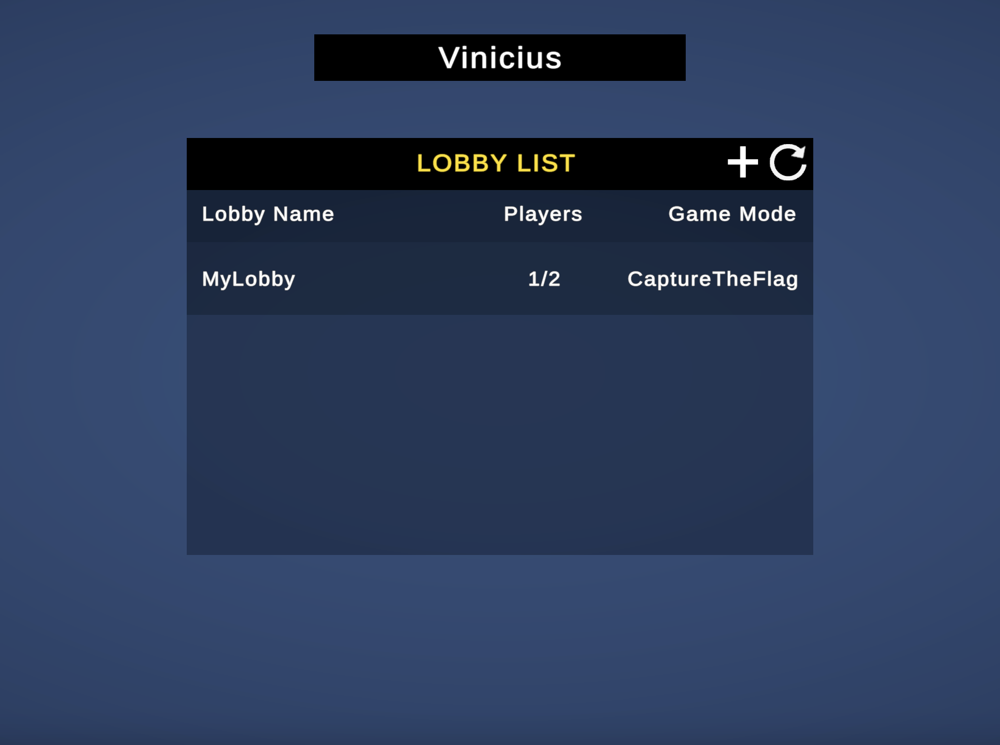
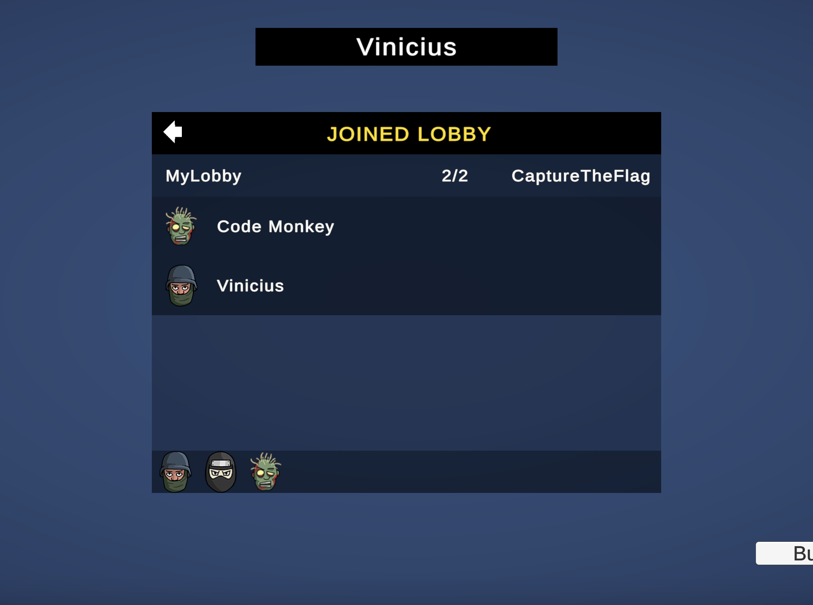
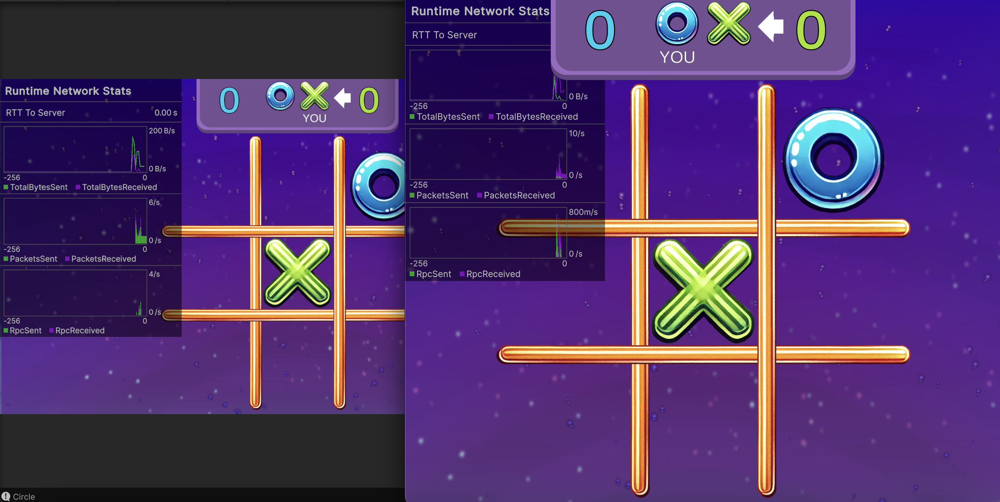

# 🕹️ Multiplayer Tic Tac Toe (Unity + Netcode)

This project is a fully functional **multiplayer Tic Tac Toe game** built with **Unity** using **Netcode for GameObjects**, **Unity Lobby**, and **Relay services**. It demonstrates how to implement real-time multiplayer features like matchmaking, turn-based logic, synced scores, sound effects, and rematches — all using Unity’s official networking stack.

---

## ✨ Features

- 🎮 Classic Tic Tac Toe with turn-based gameplay  
- 🌐 Real-time multiplayer with Unity Lobby + Relay  
- 📡 Networked synchronization using NetworkVariable and RPCs  
- 🏆 Automatic win, loss, and tie detection  
- 🔁 Rematch system with score tracking  
- 🔊 Local sound effects and background music  
- 📱 Clean UI with GameOver screen and feedback  
- 🧪 Modular codebase for easy expansion and learning  

---

## 🚀 Technologies

- **Unity 6**  
- **Unity Netcode for GameObjects**  
- **Unity Lobby & Relay Services**  
- **C# Events & Delegates**  
- **AudioSource, UI Toolkit, and GameManager patterns**

---

## 📸 Screenshots

### 🔐 Player Authentication

### 📋 Creating and Joining a Lobby
  
  

### 🎮 Working Multiplayer Example
  

---

## 🧠 Learning Focus

This project was built for **educational purposes** — to demonstrate how small-scale multiplayer games can be prototyped in Unity using modern networking tools, without relying on third-party plugins.

I completed this project following this tutorial by Code Monkey:
https://youtu.be/YmUnXsOp_t0?si=3RSUPIlbplx6e58Z

